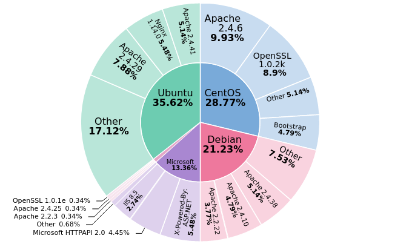

<p align="center">

</p>
<p align="center">


</p>

## Introduction
Pwndora is a massive and fast IPv4 address range scanner, integrated with multi-threading. Using sockets, it analyzes which ports are open, and collects more information about targets.

This project allows users to create their own IoT search engine at home, in simple steps, for educational purposes. 

## Features

- Port scanning with different options and retrieve software banner information.
- Detect some web technologies and operating systems running on servers, using [Webtech](https://github.com/ShielderSec/webtech) integration.   
- Retrieves IP geolocation from Maxmind free database file, updated periodically. 
- Anonymous login detection on FTP servers.
- Send notifications with results using Slack API.
- Different ways to store data: MongoDB and JSON file.
- Multi thread mode, with a limit of 400 threads

## Visual
<a href="https://asciinema.org/a/470234" target="_blank"></a>

## Getting Started
### Manual Installation
> Make sure you have $HOME/.local/share directory, to avoiding issues with Webtech.
  
> To use slack argument, you should configure [Incoming Webhooks](https://api.slack.com/messaging/webhooks) URL in config.py
1. Clone this repository
2. Install requirements with Python PIP
3. Finally start scanner
### Using Docker image (Recommended)
```
docker pull alechilczenko/pwndora:3.1
```
## Usage
### Options
```
options:
  -h, --help            show this help message and exit
  -s START, --start START
                        Start IPv4 address
  -e END, --end END     End IPv4 address
  -t THREADS, --threads THREADS
                        Number of threads [Default: 50]
  -m FILE, --massive-scan FILE
                        File path with IPv4 ranges
  -ti TIMEOUT, --timeout TIMEOUT
                        Socket timeout [Default: 0.5]
  -p, --top-ports       Scan only 20 most used ports
  -a, --all-ports       Scan 1000 most used ports
  -c CUSTOM [CUSTOM ...], --custom-ports CUSTOM [CUSTOM ...]
                        Scan custom ports directly from terminal
  -sl, --slack          Send notifications by Slack with results
  -sv {json,mongodb}, --save {json,mongodb}
                        Methods of data storage
  -l, --logs            Add a log file, useful in debugging
```
### Examples
Scan only a single IPv4 address range:
 ```bash
python3 CLI.py -s 192.168.0.0 -e 192.168.0.255 -t 150 --top-ports -sv json
 ```
Scan from a text file with multiple IPv4 address ranges:
```bash
python3 CLI.py -m ranges.csv -t 200 -ti 5 --all-ports --save mongodb
```
Scan with custom ports and logs options:
```bash
python3 CLI.py -m ranges.csv -t 350 --custom-ports 80 21 22 -sv json --logs
```
### Usage with MongoDB
To insert the results into a database, you must set the following environment variables:
> Tip: You can create an instance of MongoDB and Mongo Express using [docker-compose](https://github.com/alechilczenko/pwndora/blob/main/docker/mongodb-mongo_express.yml). 
```
export MONGODB_URI="mongodb://localhost:27017"
export MONGODB_USER="user"
export MONGODB_PASS="password"
```
## The right way (Elasticsearch and Kibana)
### How create your own IoT search engine?
After storing results in our database, we can integrate Elasticsearch to perform fast searches. You can synchronize MongoDB and Elasticsearch using the tool: [Mongo-to-elastic-dump](https://github.com/sameer17cs/mongo-to-elastic-dump.git).

Finally we added Kibana to visualize data and create graphs with statistics.

### Graphs Example


## Contributing
If you have ideas or future features, feel free to participate to continue making this project great. 

## Legal Disclaimer
This project is made for educational and ethical testing purposes only. Usage of this software for attacking targets without prior mutual consent is illegal. It is the end user's responsibility to obey all applicable local, state and federal laws. Developers assume no liability and are not responsible for any misuse or damage caused by this program. 

## Contact
alechilczenko@gmail.com

## License
[Apache 2.0](http://www.apache.org/licenses/LICENSE-2.0.html)
